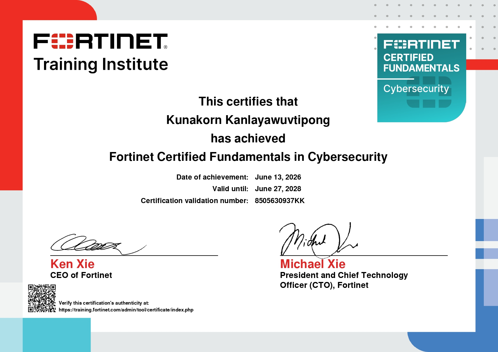
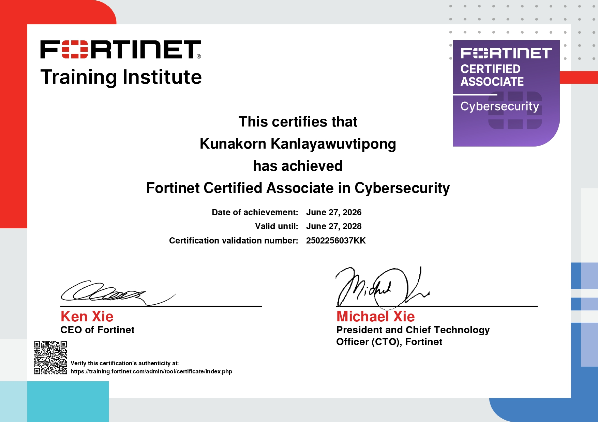

# Kunakorn Kanlayawutipong
Aspiring Cybersecurity Professional | Kasetsart University 

---
## Certification

# ISC2 Certified in Cybersecurity (CC) - May 2026 
 

### ✅ Fortinet Certified Fundamentals (FCF) — June 2026

### ✅ Fortinet Certified Associate (FCA) — June 2026

---

## 🛠️ Skills
- Security Tools: OWASP ZAP, Wireshark, Kali Linux, Metasploit
- Programming: C, Java, JavaScript, SQL
- Frameworks: Robot Framework, Selenium, Playwright
