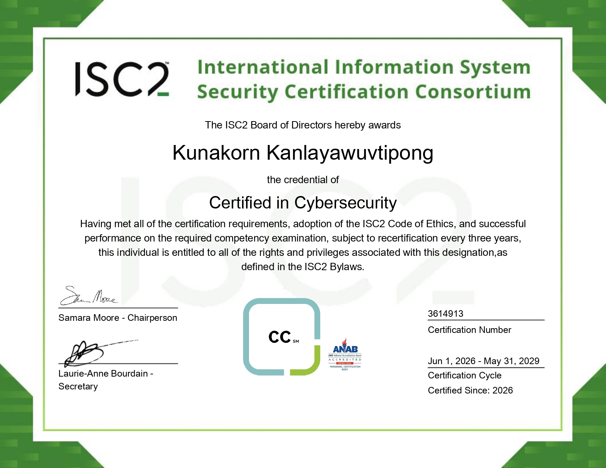

# Kunakorn Kanlayawuvtipong
Aspiring Cybersecurity Professional | Kasetsart University

---

## 🏆 Certifications

### ✅ ISC2 Certified in Cybersecurity (CC) — May 2026

### ✅ Fortinet Certified Fundamentals (FCF) — June 2026

### ✅ Fortinet Certified Associate (FCA) — June 2026

---

## Skills
- Security Tools: OWASP ZAP, Wireshark, Kali Linux, Metasploit
- Programming: C, Java, JavaScript, SQL ,Cobol
- Frameworks: Robot Framework, Selenium, Playwright

## Learn
- TryHackMe: [tryhackme.com/p/kunakorn.kan](https://tryhackme.com/p/kunakorn.kan) 
